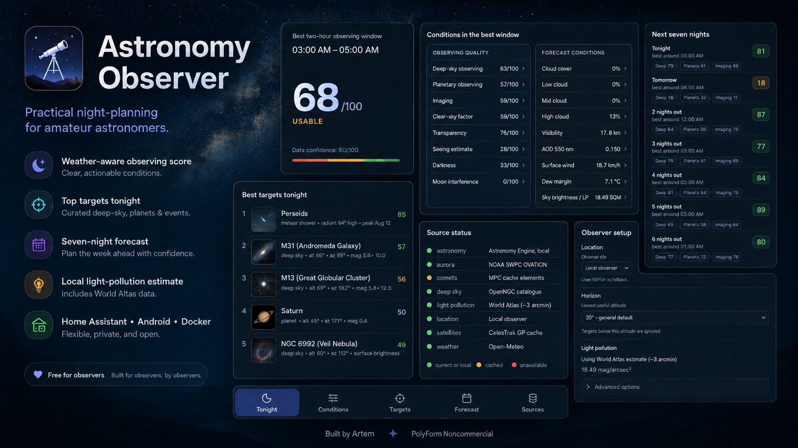

<p align="center">
  
</p>

<h1 align="center">Astronomy Observer</h1>

<p align="center">
  <strong>A practical night-planning companion for amateur astronomers — when to go out, what to observe, and how much confidence to place in the forecast.</strong>
</p>

<p align="center">
  <a href="https://github.com/ArrowSK/ha-astronomy-observer/actions/workflows/ci.yaml"></a>
  <a href="https://github.com/ArrowSK/ha-astronomy-observer/actions/workflows/builder.yaml"></a>
  <a href="https://github.com/ArrowSK/ha-astronomy-observer/actions/workflows/android.yaml"></a>
  
  
  
  
</p>

<p align="center">
  <a href="https://my.home-assistant.io/redirect/supervisor_add_addon_repository/?repository_url=https%3A%2F%2Fgithub.com%2FArrowSK%2Fha-astronomy-observer"></a>
  &nbsp;
  <a href="https://github.com/ArrowSK/ha-astronomy-observer/actions/workflows/android.yaml"></a>
  &nbsp;
  <a href="https://railway.com/new"></a>
  &nbsp;
  <a href="#standalone-docker-web-app"></a>
</p>

<p align="center">
  <sub>Home Assistant · standalone Android · Docker · Railway / other container hosting — all built around the same observing engine.</sub>
</p>

---

<p align="center">
  
</p>

## What it gives you

Astronomy Observer is built for the question an ordinary weather app does not really answer: **is tonight actually worth observing, when is the useful window, and what should you point the telescope at?**

| | |
|---|---|
| **Best two-hour observing window** | A simple headline for the strongest part of the night instead of making you interpret every forecast hour yourself |
| **Separate observing scores** | Deep-sky, planetary and imaging conditions are kept distinct because they do not depend on the sky in quite the same way |
| **Targets ranked for your sky** | Altitude, local horizon, Moon separation, sky brightness, object type and configured equipment all matter |
| **Seven-night forecast** | Compare upcoming nights with the same scoring logic instead of guessing from cloud icons |
| **Readable evidence** | Condition rows expand to explain how each value is derived; unknown inputs stay unknown rather than being invented |
| **Offline object thumbnails** | Messier objects and selected familiar targets can show small bundled images with per-image licence and attribution data |
| **Built-in light pollution** | A compact World Atlas derivative follows the observing location automatically and already affects darkness-sensitive scoring |

No Astronomy Observer account is required. There is no project telemetry service, analytics SDK, advertising service, paid astronomy API requirement or project-operated cloud backend. Changing public data are fetched from their documented providers; core astronomy, catalogues, scoring and bundled light-pollution data stay with the installed application.

> **Current release: 0.3.2.** Astronomy Observer is still marked experimental, but the same core is now exercised through Home Assistant, standalone Docker/web and a fully standalone Android build.

## Choose how to run it

### Android — nothing to host

The most independent option. The APK contains the interface, Rust observing engine, Astronomy Engine, reduced deep-sky catalogue, meteor-shower table, bundled object thumbnails and compact World Atlas light-pollution grid.

It does **not** load Astronomy Observer from a website and it does not need Home Assistant, Railway, this repository or any server run by the project owner after installation.

Use the phone's location or enter an observing site manually. Sun/Moon/planet calculations, target geometry, catalogue lookup, horizon handling, light pollution and the observation journal work on the device. Fresh weather, comet, satellite and aurora information naturally needs internet access and is requested directly from the documented public providers; recent changing data are cached locally.

The current GitHub Actions build produces an installable **debug-signed preview APK**. A long-lived public sideload release should use one stable private signing key so future versions can update the same installed app identity.

[Android guide →](docs/ANDROID.md) · [Android build workflow →](https://github.com/ArrowSK/ha-astronomy-observer/actions/workflows/android.yaml)

### Home Assistant

Best if Astronomy Observer should become part of the smart home rather than live as a separate planner.

[](https://my.home-assistant.io/redirect/supervisor_add_addon_repository/?repository_url=https%3A%2F%2Fgithub.com%2FArrowSK%2Fha-astronomy-observer)

The button opens Home Assistant with this repository URL pre-filled. Install **Astronomy Observer**, start it, then open the app from the sidebar. In **Setup**, choose the observer and the lowest useful altitude for the site.

Home Assistant mode can follow a `person` entity, use Home coordinates as fallback, publish sensors for dashboards and automations, use a Home Assistant SQM sensor, and keep the whole observing interface inside Ingress.

[Home Assistant guide →](astronomy_observer/DOCS.md)

### Standalone Docker web app

Best for a NAS, Raspberry Pi, home server, VPS or homelab when you want Astronomy Observer as a normal browser-based service.

```sh
docker build -f webapp/Dockerfile -t astronomy-observer-web .
docker run --rm -p 8080:8080 -e PORT=8080 astronomy-observer-web
```

Open `http://localhost:8080`, go to **Setup**, and enter the observing site. The standalone container uses the same astronomy, weather, scoring, target-ranking and light-pollution modules as the other editions.

[Standalone web guide →](docs/WEBAPP.md)

### Railway or another container host

Best if you want a hosted web deployment without maintaining the machine yourself.

[](https://railway.com/new)

The root [`railway.toml`](railway.toml) points Railway at `webapp/Dockerfile` and uses `/health` for deployment health checks. The button opens Railway's standard new-project flow; this repository does not create or deploy a Railway project automatically.

[Railway / container deployment guide →](docs/WEBAPP.md)

## How to read the dashboard

Astronomy Observer deliberately keeps the headline score and the evidence behind it separate.

| Section | What it tells you |
|---|---|
| **Tonight** | Best two-hour observing window and overall usefulness of the night |
| **Conditions** | Deep-sky, planetary and imaging quality plus the forecast inputs behind those scores |
| **Targets** | The strongest objects for the current location, time, horizon and configured equipment |
| **Forecast** | The next seven nights using the same scoring model |
| **Sources** | Which astronomy, weather, catalogue, light-pollution, comet, satellite and aurora sources are current, cached or unavailable |

The source-status dots are intentionally simple: green means current/local, amber means cached/fallback/disabled, and red means unavailable/failed. Missing values reduce confidence instead of being silently replaced with optimistic assumptions.

Expandable condition rows explain how each value was calculated. Seeing is a **relative proxy score**, not fabricated arcsecond precision. Satellite brightness is not invented when the source data do not provide it. Those limitations are part of the product rather than hidden implementation details.

## What goes into the answer

Depending on source availability, the current planner can use:

- total, low, middle and high cloud cover;
- visibility, humidity, dew point and dew margin;
- aerosol optical depth;
- surface and upper-air wind;
- local Sun, Moon and planet calculations;
- Moon illumination and target-specific Moon separation;
- local horizon limits and target altitude / airmass;
- location-based sky brightness from the bundled World Atlas derivative or a higher-priority SQM/custom input;
- reduced OpenNGC observing catalogue with Messier cross-references;
- Milky Way / Galactic Centre opportunities and major meteor showers;
- active-comet candidates from Minor Planet Center elements;
- visible-satellite passes from CelesTrak elements;
- NOAA OVATION aurora probability.

The scoring model is deterministic and does not depend on a remote scoring or news-sentiment service.

## Recognisable targets, without a remote image service

Astronomy Observer bundles compact target thumbnails for the Messier catalogue plus a limited set of familiar planets, the Moon, the Milky Way and major meteor showers.

The image set is intentionally conservative. The builder first requests a representative free image and then verifies the corresponding Wikimedia Commons licence metadata. Only Public Domain, CC0, CC BY and CC BY-SA files are accepted. Fair-use/non-free, NonCommercial, NoDerivatives, GFDL-only and unknown licences are rejected.

Each accepted thumbnail keeps its own source, creator, licence and attribution in the bundled manifest and credits page. The credits page includes a clear return control in embedded views, while external source and licence links open separately. If a target has no accepted image, the interface simply falls back to the normal astronomy marker.

[Object-image licence details →](THIRD_PARTY_LICENSES.md#wikimedia-commons-object-thumbnails)

## One core, every installation

Home Assistant, standalone web/Docker and Android are different deployment shells around the same observing logic rather than three separately maintained astronomy products.

```text
astronomy_observer/src/       astronomy, weather, scoring, targets, sources
astronomy_observer/web/       shared browser interface
astronomy_observer/           Home Assistant packaging
webapp/                       standalone Docker / Railway adapter
android/                      self-contained Android shell and native bridge
```

That matters because a scoring, target-ranking or light-pollution fix is made once and inherited by each edition. CI checks the shared runtime, standalone web image, Android packaging, licensed thumbnails and Home Assistant images to reduce platform drift.

## Privacy and independence

Astronomy Observer does **not** send usage data to ArrowSK, GitHub or a project-operated backend.

Exact location is used locally for astronomy calculations. External provider queries use the configured coordinate precision rather than deliberately sending more location precision than needed. Android talks directly to the public providers it needs; standalone web does the same; Home Assistant additionally talks to Home Assistant's internal APIs for the integrations you explicitly enable.

Core astronomy calculations, target catalogues, meteor data, light-pollution data, the web interface and object thumbnails ship with the installed release. A running Android app or container does not need this GitHub repository to remain online for those local capabilities to continue working.

If you expose the standalone web app publicly, put it behind an authenticated reverse proxy or another access-control layer; the standalone container does not add user authentication by itself.

[Android privacy / offline behaviour →](docs/ANDROID.md) · [Web deployment and privacy →](docs/WEBAPP.md) · [Architecture →](docs/ARCHITECTURE.md)

## Documentation

| Start here | Deeper reference |
|---|---|
| [Home Assistant app guide](astronomy_observer/DOCS.md) | [Architecture](docs/ARCHITECTURE.md) |
| [Android guide](docs/ANDROID.md) | [Data sources](docs/DATA_SOURCES.md) |
| [Docker & Railway guide](docs/WEBAPP.md) | [Light pollution model](docs/LIGHT_POLLUTION.md) |
| [Third-party licences](THIRD_PARTY_LICENSES.md) | [Contributing](CONTRIBUTING.md) |

## Licence

Copyright 2026 ArrowSK.

Astronomy Observer's original code is licensed under the **PolyForm Noncommercial License 1.0.0**. It is source-available for noncommercial use and is not an OSI-approved open-source licence. See [LICENSE](LICENSE).

Bundled and downloaded third-party code, datasets and images keep their own licences and are **not** relicensed under PolyForm. This includes Astronomy Engine, the OpenNGC-derived observing catalogue, the World Atlas light-pollution derivative, Wikimedia Commons thumbnails and runtime provider data.

See [Third-party code and data](THIRD_PARTY_LICENSES.md) for the exact attribution and licence separation.
